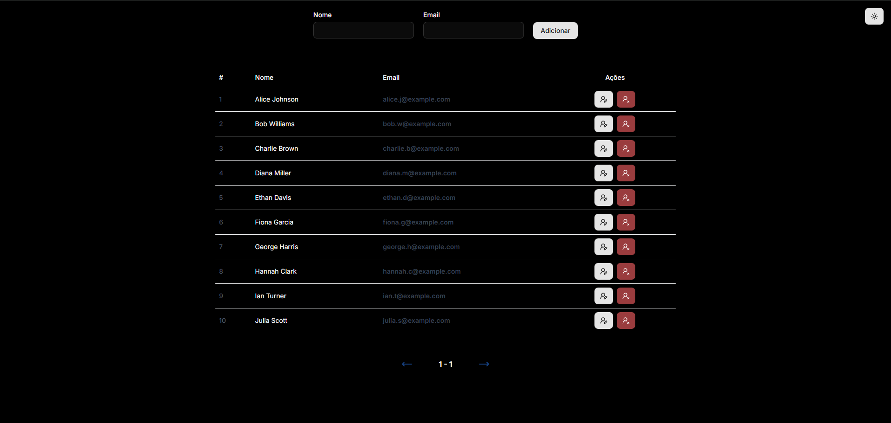
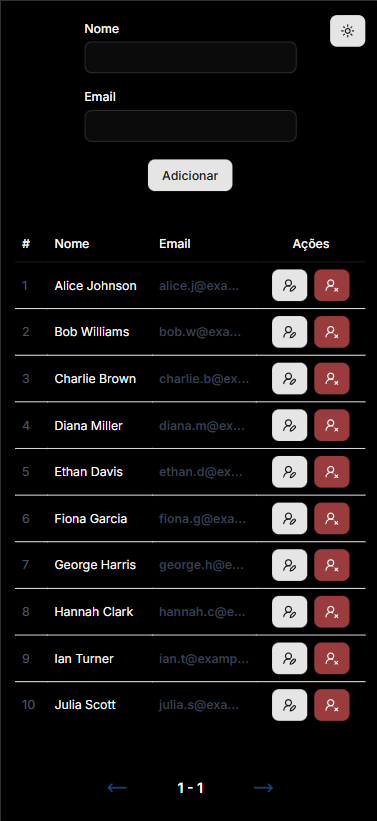

# CRUD de Usuários (Next.js + Supabase)

## 📌 Funcionalidades

- ➕ Criar usuários

- 📄 Listar usuários

- ✏️ Atualizar dados de usuários

- ❌ Remover usuários

## 📸 Screenshot







## 🛠️ Tecnologias Utilizadas 

- Next.js: Framework React. 
- TypeScript: Superset de JavaScript que adiciona tipagem estática. 
- Supabase: Backend-as-a-Service com banco de dados PostgreSQL. 
- Tailwind CSS: Framework de CSS utilitário para estilização. 
- Shadcn/ui: Coleção de componentes de UI. 
- Lucide React: Biblioteca de ícones. 

## 📂 Estrutura do Projeto

```bash
├── .github
│   ├── desktop.png
│   ├── mobile.png
│   ├── desktop-darkmode.png
│   └── mobile-darkmode.png
├── app
│   ├── _components
│   ├── favicon.ico
│   ├── global.css
│   ├── layout.tsx
│   └── page.tsx
├── components
│   └── ui
├── lib
│   ├── hooks
│   ├── providers
│   └── supabase
├── public
├── .env.example
├── .gitignore
├── components.json
├── db.sql
├── eslint.config.mjs
├── next.config.ts
├── package.json
├── postcss.config.mjs
├── README.md
└── tsconfig.json
```

## ⚙️ Instalação do Projeto

Clone o projeto

```bash
  git clone https://github.com/leonardomaran-dev/user-crud.git
```

Entre no diretório do projeto

```bash
  cd user-crud
```

Instale as dependências

```bash
  npm install
  # ou
  pnpm install
  # ou
  yarn install
```

## ⚙️ Configuração do Banco de Dados
Este projeto utiliza o Supabase como banco de dados PostgreSQL e backend-as-a-service.

1️⃣ Criar o projeto no Supabase

- Acesse: https://supabase.com
- Crie um novo projeto
- Anote as seguintes informações: 
  * `NEXT_PUBLIC_SUPABASE_URL`
  * `NEXT_PUBLIC_SUPABASE_PUBLISHABLE_DEFAULT_KEY`

```bash
Encontre-as em: Acesse o Projeto -> Connect -> App Frameworks -> Next.js
```
2️⃣ Criar a tabela `users`

- Copie e cole o conteúdo do arquivo `db.sql` (raíz do projeto) no **SQL Editor** do seu projeto Supabase e execute o comando.

```bash
Este comando irá criar a tabela e alguns registros fictícios
```
⚠️ **Nota:** O RLS precisa estar desabilitado.

## Estrutura do Banco de Dados

| Coluna   | Tipo       | Opções                     |
| :---------- | :--------- | :---------------------- |
| `id` | `int8` |`Primary Key`|
| `name` | `text` ||
| `email` | `text` | `Is Unique` |
| `created_at` | `timestamptz` |`DEFAULT: NOW()`|

## ⚙️ Configuração do Ambiente

1️⃣ Crie o arquivo .env

```bash
cp .env.example .env
```

2️⃣ Configure o .env

```bash
#SUPABASE

NEXT_PUBLIC_SUPABASE_URL='<SUA-SUPABASE-URL>'
NEXT_PUBLIC_SUPABASE_PUBLISHABLE_DEFAULT_KEY='<SUA-SUPABASE-PUBLISHABLE-DEFAULT-KEY>'
```

3️⃣ Inicie o servidor

```bash
  npm run dev
  # ou
  pnpm dev
  # ou
  yarn run dev
```
⚠️ **Nota:** Por padrão seu projeto rodará em: [http://localhost:3000](http://localhost:3000)

## 👤 Autor

Leonardo Maran

- GitHub: https://github.com/leonardomaran-dev
- LinkedIn: https://www.linkedin.com/in/leonardo-maran-02275a2b1

## 📄 Licença

[MIT](https://choosealicense.com/licenses/mit/)