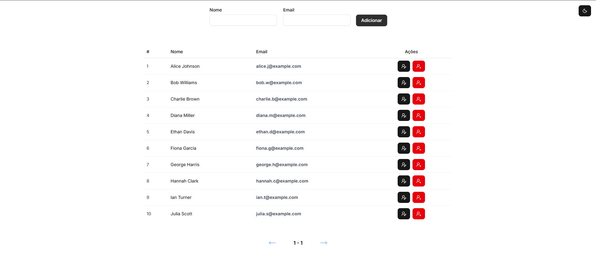
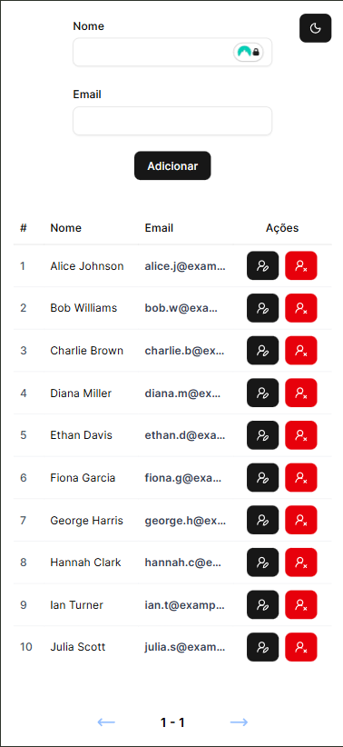

# CRUD de Usuários (Next.js + Supabase)

## 📌 Funcionalidades

- ➕ Criar usuários

- 📄 Listar usuários

- ✏️ Atualizar dados de usuários

- ❌ Remover usuários

## 📸 Screenshot

Versão Desktop


Versão Mobile


## 🛠️ Tecnologias Utilizadas 

- Next.js: Framework React. 
- TypeScript: Superset de JavaScript que adiciona tipagem estática. 
- Supabase: Backend-as-a-Service com banco de dados PostgreSQL. 
- Tailwind CSS: Framework de CSS utilitário para estilização. 
- Shadcn/ui: Coleção de componentes de UI. 
- Lucide React: Biblioteca de ícones. 

## 📂 Estrutura do Projeto

```bash
├── app
│   ├── _components
│   ├── favicon.ico
│   ├── global.css
│   ├── layout.tsx
│   └── page.tsx
├── components
│   └── ui
├── lib
│   ├── hooks
│   ├── providers
│   └── supabase
├── public
├── .env.example
├── .gitignore
├── components.json
├── eslint.config.mjs
├── next.config.ts
├── package.json
├── postcss.config.mjs
├── README.md
├── seed.sql
└── tsconfig.json
```

## ⚙️ Configuração do Banco de Dados
Este projeto utiliza o Supabase como banco de dados PostgreSQL e backend-as-a-service.

1️⃣ Criar o projeto no Supabase

- Acesse: https://supabase.com
- Crie um novo projeto
- Anote as seguintes informações: 
  * `NEXT_PUBLIC_SUPABASE_URL` e `NEXT_PUBLIC_SUPABASE_PUBLISHABLE_DEFAULT_KEY`

2️⃣ Criar a tabela `users`

- Crie uma tabela chamada `users`
- Desabilite o `RLS` (⚠️ **Nota:** Isso deixa o banco público. Para produção, configure Políticas de Segurança RLS).

3️⃣ Criar as colunas `name` e `email`

| Coluna   | Tipo       | Opções                     |
| :---------- | :--------- | :---------------------- |
| `name` | `text` ||
| `email` | `text` | `Is Unique` |

```bash
Obs: colunas 'id' e 'created_at' já estão configuradas por padrão
```

## 🌱 Populando o Banco de Dados

O Supabase permite adicionar registros através de upload de arquivo `.csv`, você pode criá-lo manualmente ou pedir para IA criá-lo com a quantidade desejada.
Você pode popular o banco de dados de duas maneiras:

-  **Via Editor SQL:** Copie e cole o conteúdo do arquivo `seed.sql` no **SQL Editor** do seu projeto Supabase e execute o comando.

-  **Via CSV:** O Supabase também permite adicionar registros através de upload de arquivo `.csv`. Você pode criar um arquivo CSV manualmente ou usar uma ferramenta para gerar dados fictícios.

## ⚙️ Configuração do Ambiente

Clone o projeto

```bash
  git clone https://github.com/leonardomaran-dev/user-crud.git
```

Entre no diretório do projeto

```bash
  cd user-crud
```

Instale as dependências

```bash
  npm install
  # ou
  pnpm install
  # ou
  yarn install
```

Crie o arquivo .env

```bash
cp .env.example .env
```

Configure o .env

```bash
#SUPABASE

NEXT_PUBLIC_SUPABASE_URL='<SUA-SUPABASE-URL>'
NEXT_PUBLIC_SUPABASE_PUBLISHABLE_DEFAULT_KEY='<SUA-SUPABASE-PUBLISHABLE-DEFAULT-KEY>'
```

Inicie o servidor

```bash
  npm run dev
  # ou
  pnpm dev
  # ou
  yarn run dev
```

## 👤 Autor

Leonardo Maran

- GitHub: https://github.com/leonardomaran-dev
- LinkedIn: https://www.linkedin.com/in/leonardo-maran-02275a2b1

## 📄 Licença

[MIT](https://choosealicense.com/licenses/mit/)